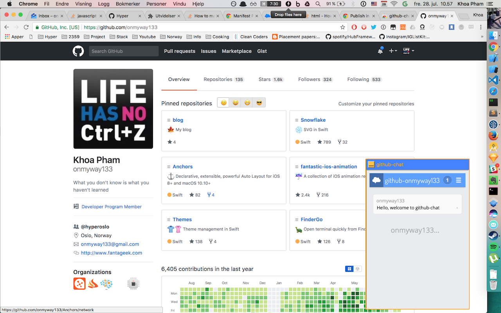

# github-chat

❤️ Support my apps ❤️ 

- [Push Hero - pure Swift native macOS application to test push notifications](https://onmyway133.com/pushhero)
- [PastePal - Pasteboard, note and shortcut manager](https://onmyway133.com/pastepal)
- [Quick Check - smart todo manager](https://onmyway133.com/quickcheck)
- [Alias - App and file shortcut manager](https://onmyway133.com/alias)
- [My other apps](https://onmyway133.com/apps/)

❤️❤️😇😍🤘❤️❤️

 

## Description

- Icon from https://www.emojione.com
- Chat from https://tlk.io/
- Available on the Chrome Web Store https://chrome.google.com/webstore/detail/github-chat/fkkkglfjngejhnmjhhpahenlligojapa

## Author

Khoa Pham, onmyway133@gmail.com

## License

**github-chat** is available under the MIT license. See the [LICENSE](https://github.com/onmyway133/github-chat/blob/master/LICENSE.md) file for more info.
